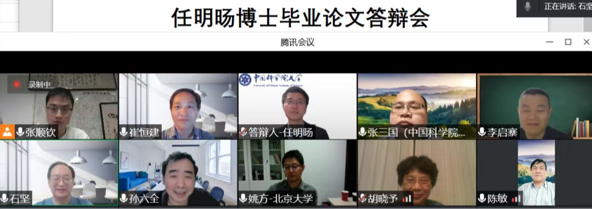

## 2022
- Jul. 15, my collaborative medical article was accepted in the top journal *JAMA Pediatrics* after 3 years of submission and revision.
- Jul. 3, affected by the epidemic, I attended my doctoral graduation ceremony online. It announced the end of my 21-year student career and the beginning of a new phase of my life.  
                   
- Jul. 1, I received the Chinese Academy of Sciences President Award, which might be a good ending to my PhD journey.       
- May 19, I defended my doctoral dissertation online, which was an important day in my life. It has been a remarkable PhD journey and there are so many people to thank along the way. [[Acknowledgements for doctoral dissertations](./publications/Acknowledgement.pdf)]
                   
- Jan. 12, my first medical SCI article was accepted in *Ophthalmology and Therapy* after 4 years of repeated submission-rejection-revision, which has really been a tough journey.

## 2021
- Nov. 17, I came to Hong Kong starting a new journey as a research assistant.
                   
- Nov. 10, I received National Scholarship for Doctoral Students after two defenses at the school and university.
- Oct. 13, the article "Gene–environment interaction identification via penalized robust divergence" was finally accepted by *Biometrical Journal*, after about 2 years of submission and revision.
- Aug. 10, the article "Hierarchical Cancer Heterogeneity Analysis Based On Histopathological Imaging Features" was accepted in *Biometrics*.
- Jun. 18, I received the *Zhu-Li-Yuehua Outstanding Doctoral Scholarship* after defending at the college and reviewing at the university.
- May 7, Ms. Wei and I got married after a five-year long love journey.
- Feb. 12, my first R package was accepted for release at CRAN, and the relevant article was also accepted by *Bioinformatics* later. Welcome to use!
- Feb. 5, I successfully proposed on the waterfront of the South Lake in my hometown!
                    
- Jan. 6, the article "Gaussian graphical model-based heterogeneity analysis via penalized fusion" was accepted in *Biometrics*.

## 2020
- Dec. 17, I successfully returned home after a 1 year joint Ph.D. program at Yale! It was a difficult journey during the COVID-19 pandemic in the US.
                    
- Sept. 24, after an online defense, I received the President Award of Academy of Mathematics and Systems Sciences, Chinese Academy of Sciences.
- Aug. 17, my first SCI article was finally accepted by *AISM* after 2 years of submission and revision, which is perhaps the small start of my academic career.
