This column will be updated with some news and random thoughts about me, sorry for being possibly quite wordy......  

## 2022
- Jul. 15, my collaborative medical article was accepted in the top journal *JAMA Pediatrics* after 3 years of submission and revision.
- Jul. 3, affected by the epidemic, I attended my doctoral graduation ceremony online. It announced the end of my 21-year student career and the beginning of a new phase of my life.  
                   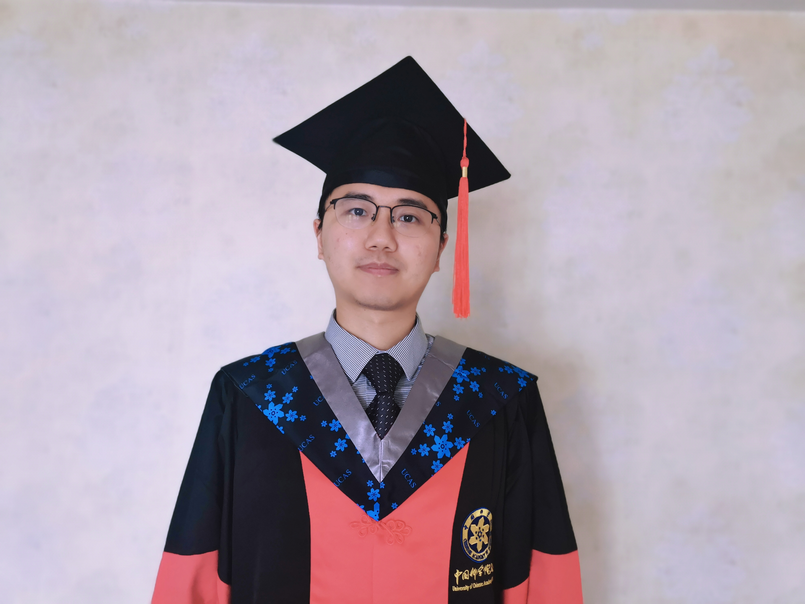
- Jul. 1, I received the Chinese Academy of Sciences President Award, which might be a good ending to my PhD journey.       
- May 19, I finished my PhD dissertation defense online, which was an important day in my life. It has been a remarkable PhD journey and there are so many people to thank along the way. [[Acknowledgements for doctoral dissertation](./publications/Acknowledgement.pdf)]  
- Jan. 12, my first medical SCI article was accepted in *Ophthalmology and Therapy* after 4 years of repeated submission-rejection-revision, which has really been a tough journey.

## 2021
- Nov. 17, I came to CityU as a research assistant starting a new and first journey in Hong Kong. Frankly, I was surprised to feel that the Yuquan Road campus of UCAS is not really small comparing to CityU.  
                   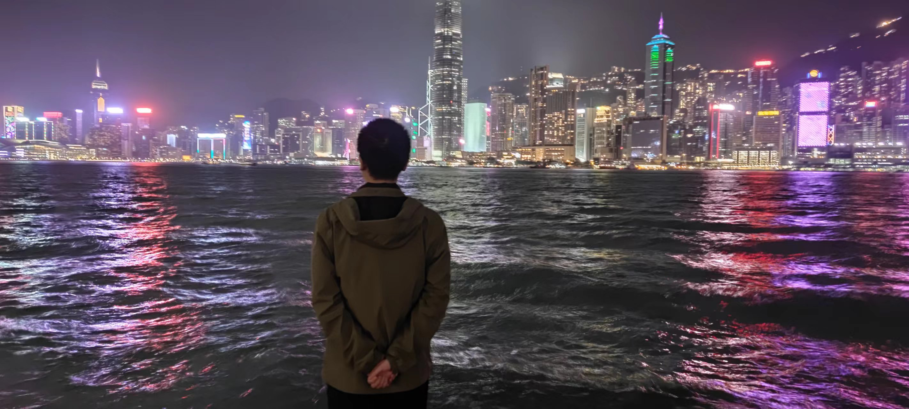 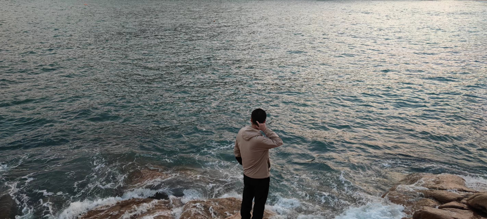
- Nov. 10, I received National Scholarship for Doctoral Students after two defenses at the school and university.
- Oct. 13, the article "Gene–environment interaction identification via penalized robust divergence" was finally accepted by *Biometrical Journal*, after about 2 years of submission and revision.
- Aug. 10, the article "Hierarchical Cancer Heterogeneity Analysis Based On Histopathological Imaging Features" was accepted in *Biometrics*.
- Jun. 18, I received the *Zhu-Li-Yuehua Outstanding Doctoral Scholarship* after defending at the school and reviewing at the university.
- May. 17, I was invited to give a science popularization report "Statistics in Life" in Huaibei High School, Huairou, Beijing. [[News](https://mp.weixin.qq.com/s/H0SmEDJxXV4HZnTuolkueA)] 
- May 7, Ms. Wei and I got married after a five-year long love journey.
- Feb. 12, my first R package [*HeteroGGM*](https://CRAN.R-project.org/package=HeteroGGM) was accepted for release at CRAN, and the relevant article was also accepted by *Bioinformatics* later. Welcome to use!
- Feb. 5, I successfully proposed on the waterfront of the South Lake in my hometown!  
                    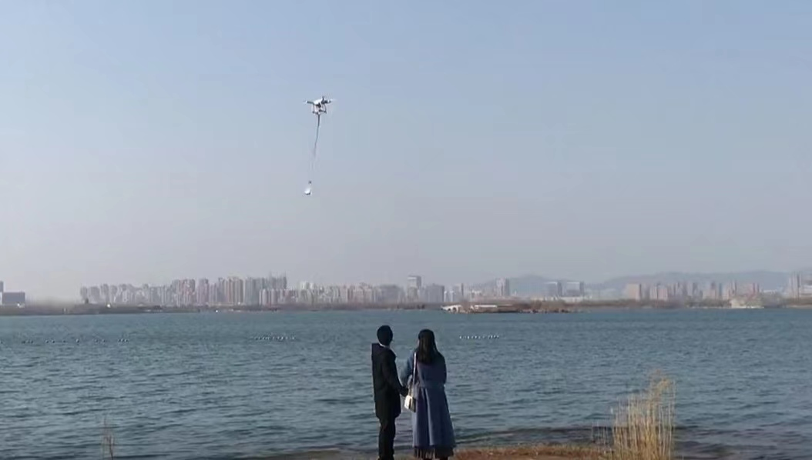
- Jan. 6, the article "Gaussian graphical model-based heterogeneity analysis via penalized fusion" was accepted in *Biometrics*.

## 2020
- Dec. 17, I successfully returned home after the one-year joint Ph.D. program at "Jialidun" university! It was a hard journey during the COVID-19 pandemic in the US. The deepest memory was the view of the four seasons outside the window...  
                    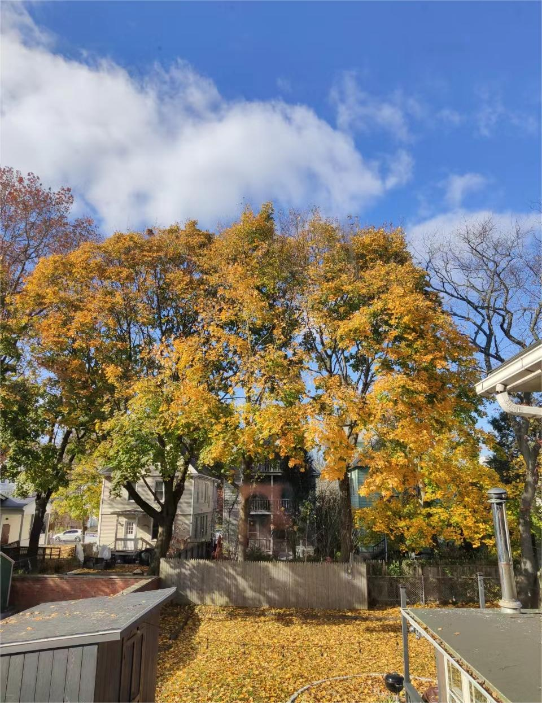
- Sep. 24, after an online defense, I received the President Award of Academy of Mathematics and Systems Sciences, Chinese Academy of Sciences.
- Aug. 17, my first SCI article was finally accepted by *AISM* after 2 years of submission and revision, which is perhaps the small start of my academic career.

## 2019
- Dec. 15, I arrived in cold New Haven and was greeted by a fierce snowstorm, which may have been a surprise to me after not seeing snow for several years.  
                     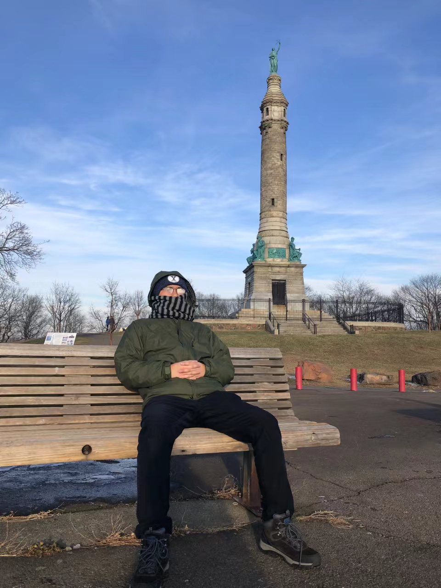  
- Nov. 2, I attended *The 19th Annual Conference of Chinese Association for Applied Statistics*, learnt cutting-edge knowledge from various outstanding speakers, and gave a small talk in Beijing, China.               
- Aug. 2, I was invited to give a report "Let data speak" on *Academic forum of Lake Research Institute*, Chinese Research Academy of Environmental Sciences.
- Jul. 26, I was awarded a scholarship by the UCAS in Joint PhD Program and would go to Yale University for exchange for one year.
- Jun. 18, I gave a small talk in the graduate academic seminar organized by the graduate association of National Science library and AMSS, CAS. [[news](https://mp.weixin.qq.com/s/OwGjg-RwRffqb8P3X7mHJQ)]  
- Apr. 20, I attended *The 5th High Dimensional Data Conference of Chinese Association for Applied Statistics* in Hangzhou, China.
                     
## 2018
- Nov. 30, I attended *The First Workshop on Data Science and Big Data in Health Care of Xiamen University*, learnt cutting-edge knowledge from various outstanding speakers, and gave a small talk. Xiamen is really a beautiful city.  
                    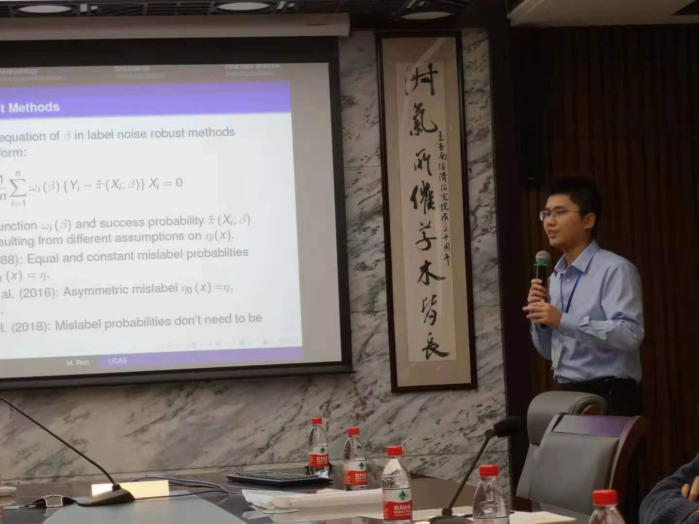
- Oct. 28, I attended *The 11th National Annual Conference on Probability and Statistics*, learnt cutting-edge knowledge from various outstanding speakers, and gave a small talk in Chengdu, China. This is a revisit to the same place after 4 years.   
- Sep. 2, I came to Yuquan Road campus of UCAS, which was perhaps the smallest campus I have ever lived on.  
                     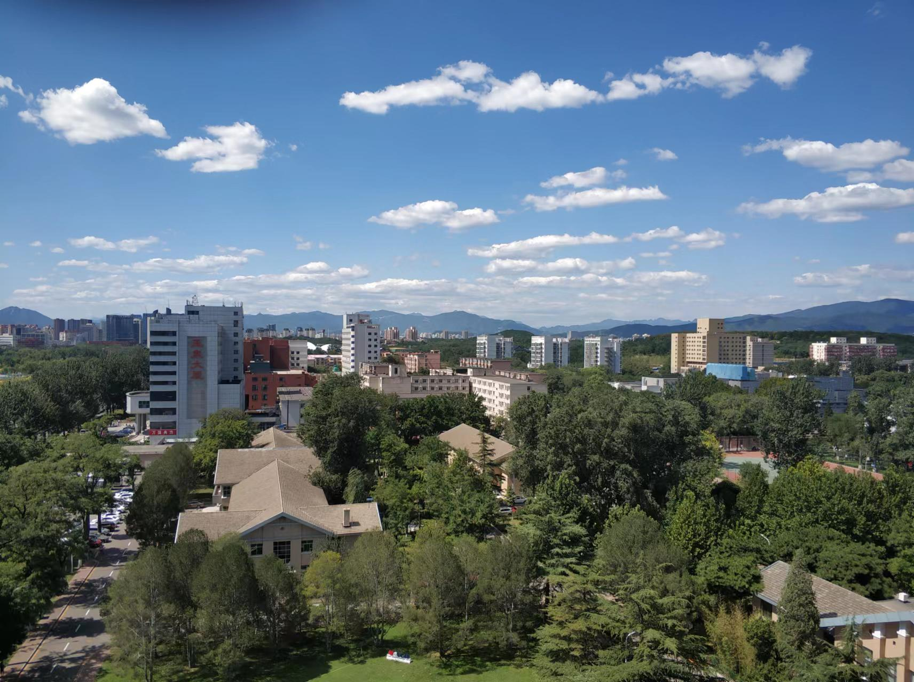  
- Aug. 25, I attended *Resource and Environment Statistics Conference of Chinese Association for Applied Statistics* in Yinchuan, China.
- Apr. 21, I attended *The 4th High Dimensional Data Conference of Chinese Association for Applied Statistics*, learnt cutting-edge knowledge from various outstanding speakers, and gave a small talk in Nanchang, China.

## 2017
- Aug. 24, I came to Yanqi Lake campus of UCAS to start my PhD journey. This is also a place with beautiful scenery by the mountain and water.    
                      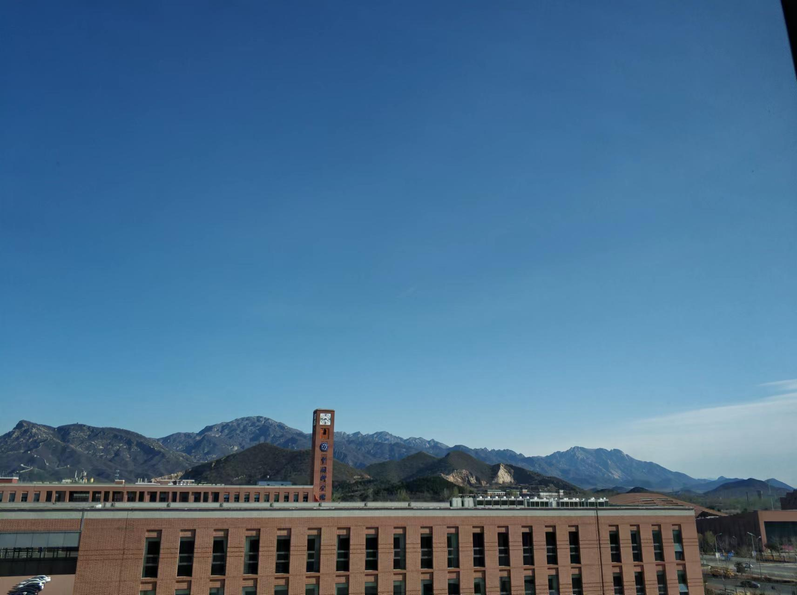   
- Jun. 22, I graduated from Wuhan University after a grand graduation ceremony. Frankly, WHU is probably the most beautiful campus I have ever seen.  
                     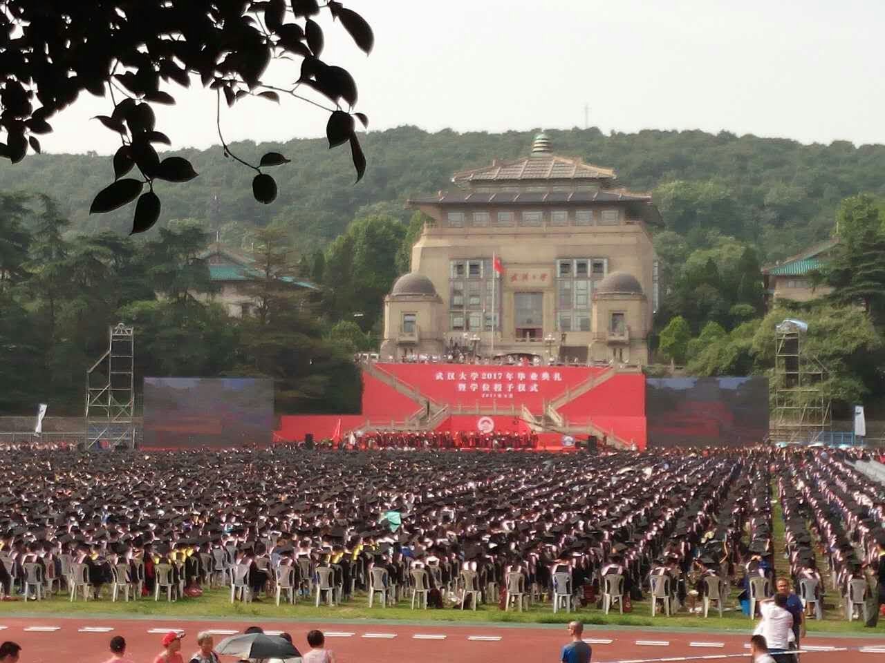 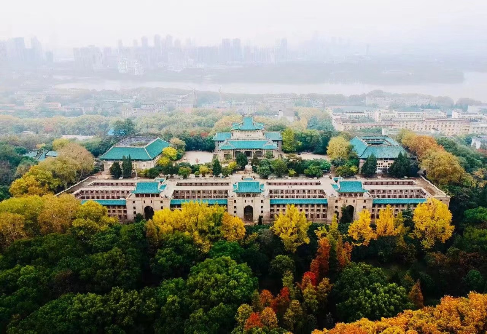 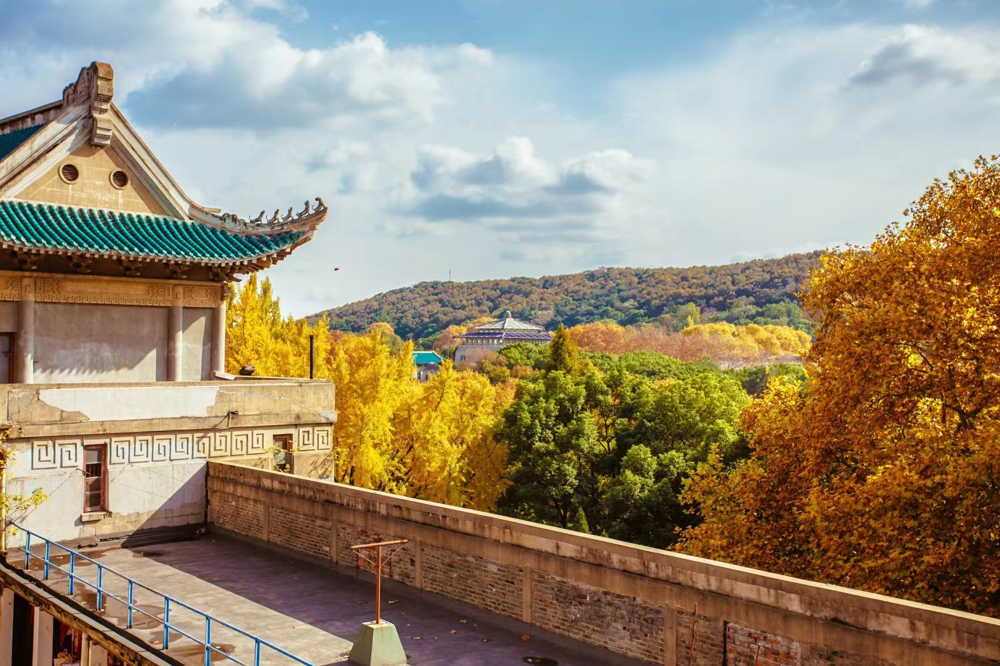

