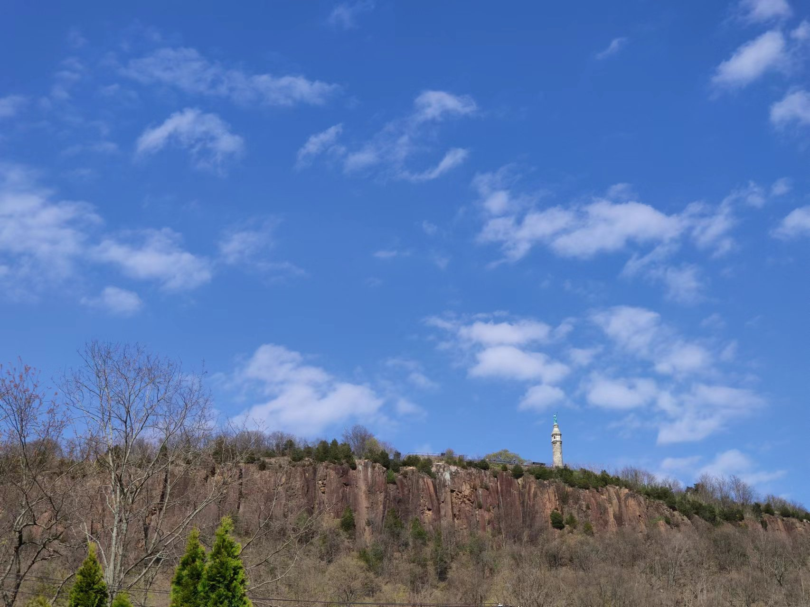
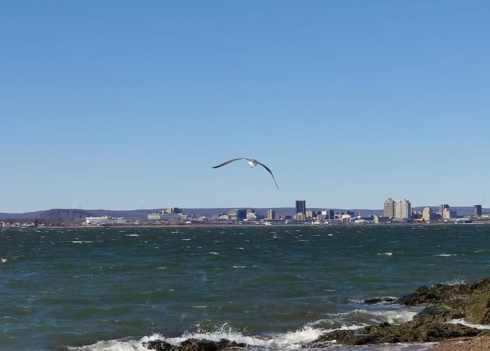

This column will be updated with some personal news.  

## 2023
- **Jul. 12** and **Jul. 14**, I was invited to present our work "Transfer DAG learning" at University of Chinese Academy of Sciences and Renmin University of China 9th International Forum on Statistics.
- **Mar. 21**, I presented our work as a *Distinguished Student Paper Award* winner at the *ENAR 2023 Spring Meeting*. Nashville's music Broadway and Hot Chicken are so crazy!
- **Jan. 9**, our R package "[***cencrne***](https://ren-mingyang.github.io//software/)" was available on CRAN.
- **Jan. 7**, our article "Consistent Estimation of the Number of Communities via Regularized Network Embedding" in ***Biometrics*** was published online.

## 2022
- **Dec. 1**, our R package "[***TransTGGM***](https://ren-mingyang.github.io//software/)" was available on CRAN.
- **Nov. 23**, our R package "[***HhP***](https://ren-mingyang.github.io//software/)" was available on CRAN.
- **Nov. 17**, our manuscript "[Transfer learning for tensor Gaussian graphical model](https://arxiv.org/abs/2211.09391)" was available on arXiv.
- **Sep. 26**, our medical article "Effect of Text Messaging Parents of School-Aged Children on Outdoor Time to Control Myopia" in ***JAMA Pediatrics*** was published online.
- **Aug. 1**, I started a new phase as a postdoctoral fellow at CUHK, another beautiful campus by the mountains and water in my journey.   
                      
                    
- **Jul. 3**, affected by the epidemic, I attended my **doctoral graduation ceremony** online. It announced the end of my 21-year student career and the beginning of a new phase of my life.   
Overall, it has been a memorable Ph.D. journey for me, during which I have studied and lived in several places for a long period of time, including Huairou and Shijingshan Districts in Beijing, Shanghai, Hong Kong, and New Haven. There is a Chinese proverb that says, "Traveling thousands of miles is better than reading thousands of books", hope to have a richer journey in the future.
- **Jul. 1**, I received the ***[Chinese Academy of Sciences President Award](https://math.ucas.ac.cn/index.php/zh-CN/news/2765-2022-2)***, which might be a good ending to my PhD journey.       
- **May 19**, I passed the **PhD dissertation defense** online, which was an important day in my life. There are so many people to thank along the way. [[Acknowledgements for doctoral dissertation](./publications/Acknowledgement.pdf)]  
- **Jan. 12**, my first medical SCI article was accepted in ***Ophthalmology and Therapy***.

## 2021
- **Dec. 1**, I came to CityU as a research assistant starting a new and first journey in Hong Kong. Frankly, I was surprised to feel that the Yuquan Road campus of UCAS is not really small compared to CityU.  
                    
- **Nov. 10**, I received ***[National Scholarship for Doctoral Students](https://math.ucas.ac.cn/index.php/zh-CN/news/2678-2021-6)***.
- **Oct. 13**, our article "Gene–environment interaction identification via penalized robust divergence" was accepted by ***Biometrical Journal***.
- **Aug. 10**, our article "Hierarchical Cancer Heterogeneity Analysis Based On Histopathological Imaging Features" was accepted in ***Biometrics***.
- **Jun. 18**, I received the ***[Zhu-Li-Yuehua Outstanding Doctoral Scholarship](https://math.ucas.ac.cn/index.php/zh-CN/news/2624-2021-2)***.
- **May. 17**, I was invited to give a science popularization report "Statistics in Life" in Huaibei High School, Huairou, Beijing. [**[News](https://mp.weixin.qq.com/s/H0SmEDJxXV4HZnTuolkueA)**] 
- **Feb. 26**, the first draft of my doctoral dissertation was finished.
- **Feb. 12**, a happy start of Chinese New Year! My first R package [***HeteroGGM***](https://CRAN.R-project.org/package=HeteroGGM) was accepted for release at CRAN, and the relevant article was also accepted by ***Bioinformatics*** later. Welcome to use!
- **Jan. 6**, a happy start of the year! Our article "Gaussian graphical model-based heterogeneity analysis via penalized fusion" was accepted in ***Biometrics***.

## 2020
- **Dec. 17**, I successfully returned home after the one-year joint Ph.D. program at "Jialidun" university! It was a hard journey during the COVID-19 pandemic in the US. The main memory of this year, reluctantly, was the scenery of the four seasons outside the window, while it was not bad...  
                      
- **Sep. 24**, I received the **President Award of Academy of Mathematics and Systems Sciences**, Chinese Academy of Sciences.
- **Aug. 17**, my first SCI article was accepted by ***AISM***.
- **May. 14**, the first time out of the house after about 2 months of working from home during the COVID-19 pandemic.  
                      

## 2019
- **Dec. 15**, I arrived in cold New Haven and was greeted by a fierce snowstorm, which may have been a surprise to me after not seeing snow for several years.  
                        
- **Nov. 2**, I presented our work at *The 19th Annual Conference of Chinese Association for Applied Statistics* in Beijing.             
- **Aug. 2**, I was invited to give a report "Let data speak" on *Academic forum of Lake Research Institute*, Chinese Research Academy of Environmental Sciences.
- **Jul. 26**, I was awarded ***[a scholarship by the UCAS in Joint PhD Program](https://old-www.ucas.ac.cn/site/157?u=67789)*** and would go to Yale University for one year.
- **Apr. 20**, I presented our work at *The 5th High Dimensional Data Conference of the Chinese Association for Applied Statistics* in Hangzhou.

                     
## 2018
- **Nov. 30**, I presented our work at *The First Workshop on Data Science and Big Data in Health Care of Xiamen University*. Xiamen is really a beautiful city.  
                    
- **Oct. 28**, I presented our work at *The 11th National Annual Conference on Probability and Statistics* in Chengdu. This is a revisit to the same place after 4 years.   
- **Sep. 2**, I came to the Yuquan Road campus of UCAS, which was perhaps the smallest campus I have ever lived on.  
                         
- **Apr. 21**, I presented our work at *The 4th High Dimensional Data Conference of the Chinese Association for Applied Statistics* in Nanchang.

## 2017
- **Aug. 24**, I came to Yanqi Lake campus of UCAS to **start my PhD journey**. This is also a place with beautiful scenery by the mountain and water.    
                         
- **Jun. 22**, I **graduated from Wuhan University** after a grand graduation ceremony. Frankly, WHU is probably the most beautiful campus I have ever seen.  
                       

