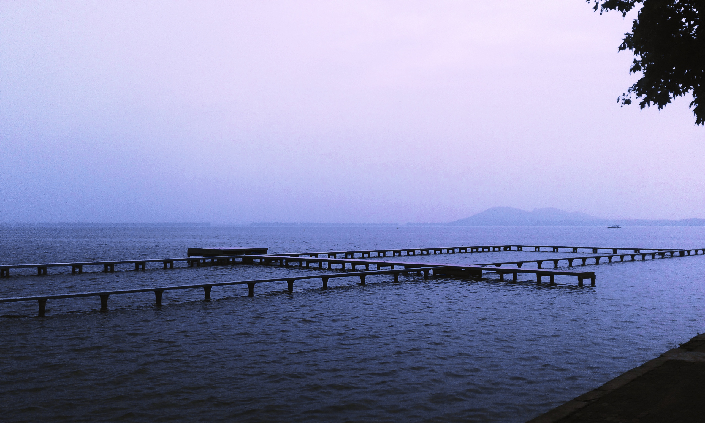
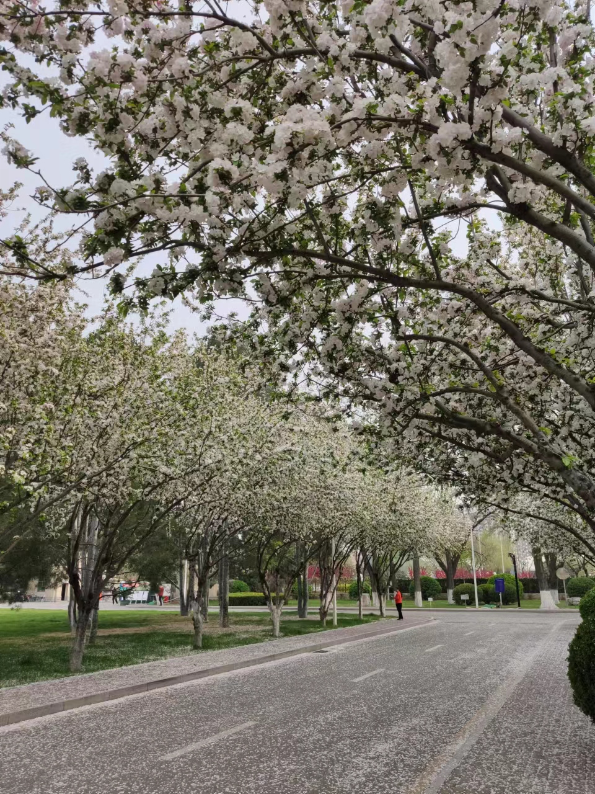
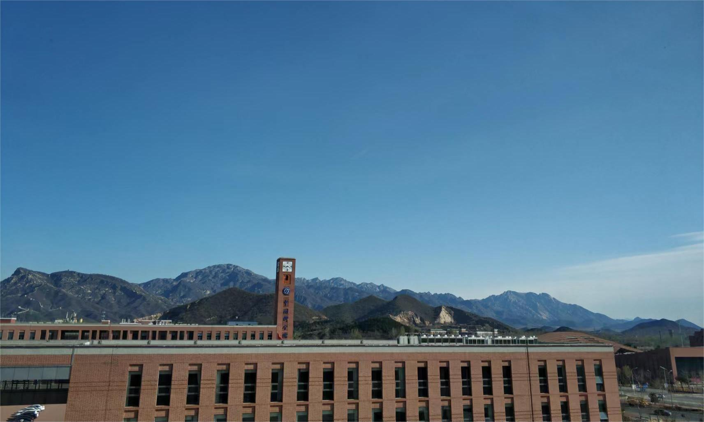
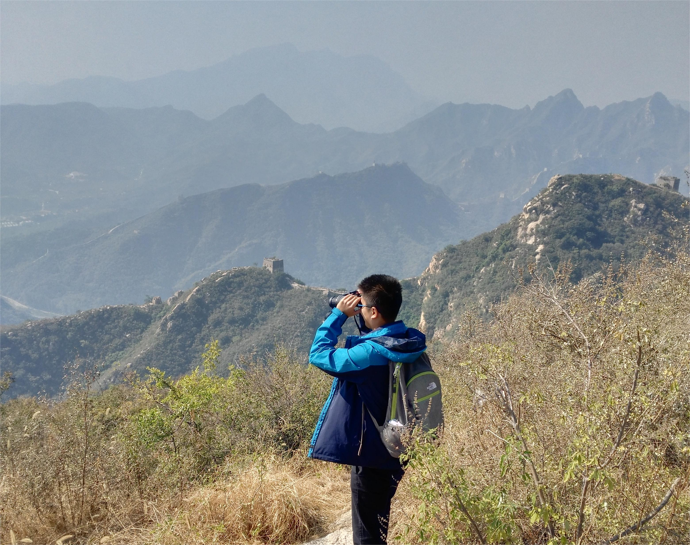

## News
- In Aug. 2024, I joined the School of Mathematical Sciences at Shanghai Jiao Tong University.

## Gallery
- My undergraduate university (probably the most beautiful campus I have ever seen)
        
        
  An out-of-print view      
  
- The place where I obtained my PhD    
Yuquan Road campus (perhaps the smallest campus I have ever lived on)  
                           
Yanqi Lake campus (also a place with beautiful scenery by the mountain and lake)    
                      
- The place I visited during the COVID-19 pandemic    
   
       
  The main memory, reluctantly, was the scenery of the four seasons outside the window, while it was not bad.
- The place where I worked as a postdoc (another beautiful campus by the mountain and lake in my journey)       
                      
                        

