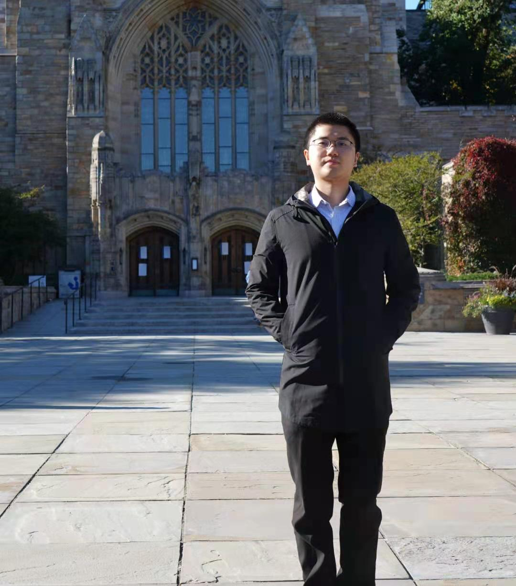

<header>
   <h1><a>Mingyang Ren</a></h1>
   
<a>Ph.D. Candidate</a>

   
<a>School of Mathematics Sciences, University of Chinese Academy of Sciences</a>

</header>

<table border="0">
  <tr>
    <td width="100%">
      <h1>Mingyang Ren (任明旸)</h1>  
      
<a>E-mail: renmingyang17@mails.ucas.ac.cn </a>

      
<a>Address: 19A, Yuquan Road, Beijing, China, 100049. </a>

      <a href="CV_Mingyang_Ren.pdf">[CV]</a><a href="https://github.com/Ren-Mingyang">[GitHub]</a><a href="/CHN.html">[中文版]</a>  
      
    </td>
  </tr>
</table>

Mingyang Ren is currently a Ph.D. candidate (Sep. 2017 - Current) in *Statistics* from [School of Mathematics Sciences](https://math.ucas.ac.cn/index.php/zh-CN/), [University of Chinese Academy of Sciences](https://www.ucas.ac.cn/), advised by Prof. [Sanguo Zhang](http://people.ucas.ac.cn/~sgzhang). He received the B.S. degree in *Mathematics* (Mathematics Base Class) from [School of Mathematics and Statistics, Wuhan University](http://maths.whu.edu.cn/), in Jun. 2017. 

He was a visiting scholar (Dec. 2019 - Dec. 2020) in Department of Biostatistics at [Yale School of Public Health](https://publichealth.yale.edu/), mentored by [Shuangge Ma](https://publichealth.yale.edu/profile/shuangge_ma/). 

## Research Interests
Analysis of High-Dimensional Data, Heterogeneity Analysis, Robust Statistics, Biostatistics.

## Journal Publications
- Gaussian graphical model-based heterogeneity analysis via penalized fusion  
**Mingyang Ren**, Sanguo Zhang, Qingzhao Zhang & Shuangge Ma  
*Biometrics*, 2021, Accepted.
- [Robust high-dimensional regression for data with anomalous responses](https://doi.org/10.1007/s10463-020-00764-1)  
**Mingyang Ren**, Sanguo Zhang & Qingzhao Zhang  
*Annals of the Institute of Statistical Mathematics*, 2020.
- [Empirical Likelihood Test for Regression Coefficients in High Dimensional Partially Linear Models](https://doi.org/10.1007/s11424-020-9260-3)  
Yan Liu, **Mingyang Ren** & Sanguo Zhang  
*Journal of Systems Science and Complexity*, 2020.
- Robust ordinal mislabel logistic regression based on gamma-divergence  
Meijun Guo, **Mingyang Ren**, Shiming Li & Sanguo Zhang  
*Journal of University of Chinese Academy of Sciences*, 2020, Accepted.
- [Effectiveness of Myopia Prediction Model in Screening Children and Teenager Myopia](http://rs.yiigle.com/CN115989201904/1129307.htm)  
Shiming Li, **Mingyang Ren**, Sanguo Zhang, He Li, Luoru Liu & Ningli Wang  
*Chinese Journal of Experimental Ophthalmology*, 2019, 37(4): 269-273.  

## Preprints
- Gene-environment interaction identication via penalized robust divergence  
**Mingyang Ren**, Sanguo Zhang, Shuangge Ma & Qingzhao Zhang  
*Biometrical Journal*, Revised.  
- Hierarchical Cancer Heterogeneity Analysis Based On Histopathological Imaging Features  
**Mingyang Ren**, Qingzhao Zhang, Sanguo Zhang, Tingyan Zhong, Jian Huang & Shuangge Ma  
*Biometrics*, Under review.
- HeteroGGM: an R package for Gaussian graphical model-based heterogeneity analysis  
**Mingyang Ren**, Sanguo Zhang, Qingzhao Zhang & Shuangge Ma  
*Bioinformatics*, Under review.  

## Honors and Awards
- 2020 &emsp; *The President Scholarship (Excellent Prize)*, Academy of Mathematics and Systems Sciences, Chinese Academy of Sciences.
- 2020 &emsp; *Merit Student*, &emsp; University of Chinese Academy of Sciences.
- 2019 &emsp; *Merit Student*, *Outstanding Student Leader*, &emsp; University of Chinese Academy of Sciences.
- 2018 &emsp; *Merit Student*, &emsp; University of Chinese Academy of Sciences.
- 2017 &emsp; *Outstanding Graduate*, &emsp; Wuhan University.
- 2016 &emsp; *Merit Student*, *Outstanding Student Leader*, *First Prize Scholarship*, *Jinshi special scholarship*, &emsp; Wuhan University.
- 2015 &emsp; *Merit Student*, *Outstanding Student Leader*, *First Prize Scholarship*, *Samsung special scholarship*, &emsp; Wuhan University.
- 2014 &emsp; *Merit Student*, *First Prize Scholarship*, &emsp; Wuhan University.
 
## Conference Reports
- Identifying Gene-environment Interactions Using a Penalized Robust Divergence Approach  
*The 19th Annual Conference of Chinese Association for Applied Statistics*  
Beijing, China, Nov. 2019.
- Robust High-Dimensional Variable Selection for Mislabel Logistic Regression  
*The 11th National Annual Conference on Probability and Statistics*  
Chengdu, China, Oct. 2018.
- Robust Signed-rank-based High-Dimensional Test for Mean Vector  
*The 4th High Dimensional Data Conference of Chinese Association for Applied Statistics*  
Nanchang, China, Apr. 2018.

## Invited Talks
- *Topic*: Let data speak  
Chinese Research Academy of Environmental Sciences, Beijing, China, Aug. 2019.

## Teaching Experiences and Services
- **Teaching Assistant**  
  Postgraduate Courses in University of Chinese Academy of Sciences:  
    &emsp; Advanced Mathematical Statistics (Fall 2018)  
    &emsp; Modern Statistical Methods (Spring 2019)  
    &emsp; Analysis of High-Dimensional Biostatistical Data (Summer 2019)  
    &emsp; Regression Analysis (Fall 2019)
- **Class Adviser**  
  2018 Undergraduate Mathematical Class in University of Chinese Academy of Sciences.
- **Instructor**  
  *High Dimensional Regression and Regularization*, Machine Learning Seminar for undergraduates, University of Chinese Academy of Sciences (Fall 2018, Fall 2019).  
  *Introduction to Artificial Intelligence*, The Short Internship Program organized by New Oriental Education in 2019.

## Software
- *HeteroGGM*, R package, [https://github.com/Ren-Mingyang/HeteroGGM](https://github.com/Ren-Mingyang/HeteroGGM).

